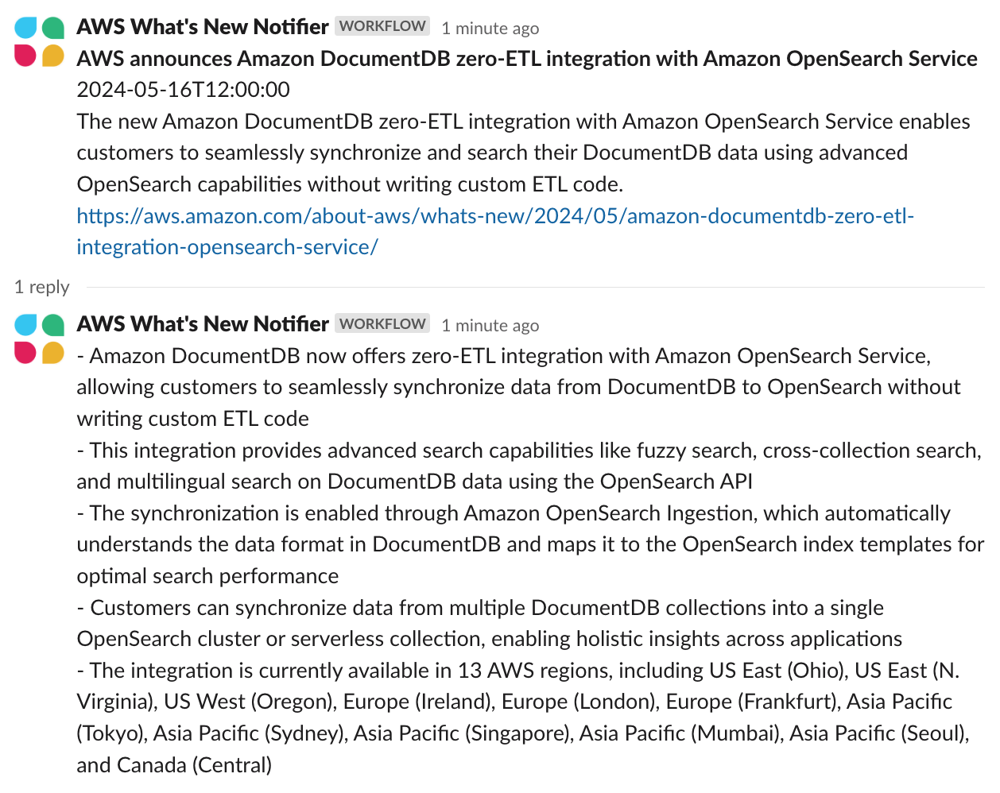

# Whats New Summary Notifier

**[日本語はこちら](README_ja.md)**

**Whats New Summary Notifier** is a sample implementation of a generative AI application that summarizes the content of AWS What's New and other web articles in multiple languages when there is an update, and delivers the summary to Slack or Microsoft Teams.

<p align="center">
  
</p>

## Architecture

This stack create following architecture.


## Prerequisites
- An environment where you can execute Unix commands (Mac, Linux, ...)
  - If you don't have such an environment, you can also use AWS Cloud9. Please refer to [Preparing the Operating Environment (AWS Cloud9)](DEPLOY.md).
- aws-cdk
  - You can install it with `npm install -g aws-cdk`. For more details, please refer to the [AWS documentation](https://docs.aws.amazon.com/cdk/v2/guide/getting_started.html).
- Docker
  - Docker is required to build Lambda functions using the [`aws-lambda-python-alpha`](https://docs.aws.amazon.com/cdk/api/v2/docs/aws-lambda-python-alpha-readme.html) construct. Please refer to the [Docker documentation](https://docs.docker.com/engine/install/) for more information.

## Deployment Steps
> [!IMPORTANT]
> This repository is set up to use the Anthropic Claude 3 Sonnet model in the US East (N. Virginia) region (us-east-1) by default. Please open the [Model access screen (us-east-1)](https://us-east-1.console.aws.amazon.com/bedrock/home?region=us-east-1#/modelaccess), check the Anthropic Claude 3 Sonnet option, and click Save changes.

### Create Webhook URL 
Create the Webhook URL required for the notifications.

#### For Microsoft Teams
First open the `cdk.json` file and change the `destination` value in the `context`-`notifiers` section from `slack` to `teams`. Then, refer to [this documentation](https://learn.microsoft.com/en-us/microsoftteams/platform/webhooks-and-connectors/how-to/add-incoming-webhook?tabs=newteams%2Cdotnet) to create the Webhook URL.

#### For Slack
Refer to [this documentation](https://slack.com/help/articles/17542172840595-Build-a-workflow--Create-a-workflow-in-Slack) to create the Webhook URL. Select "Add a Variable" and create the following 5 variables, all with the Text data type:

* `rss_time`: The time the article was posted
* `rss_link`: The URL of the article
* `rss_title`: The title of the article
* `summary`: A summary of the article
* `detail`: A bulleted description of the article

### Create AWS Systems Manager Parameter Store 

Use Parameter Store to securely store the notification URL.

#### Put into Parameter Store (AWS CLI)

```
aws ssm put-parameter \
  --name "/WhatsNew/URL" \
  --type "SecureString" \
  --value "<Input your Webhook URL >"
```

### Changing the Language Setting (Optional)
This asset is set up to output summaries in Japanese (日本語) by default. If you want to generate output in other languages such as English, open the `cdk.json` file and change the `summarizerName` value inside the `notifiers` object within the `context` section from `AwsSolutionsArchitectJapanese` to `AwsSolutionsArchitectEnglish` or another language. For more information on other configuration options, please refer to the [Deployment Guide](DEPLOY.md). For more information on other configuration options, please refer to the [Deployment Guide](DEPLOY.md).

### Execute the deployment
**Initialize**

If you haven't used CDK in this region before, run the following command:

```
cdk bootstrap
```

**Verify no errors** 
```
cdk synth
```

**Execute Deployment** 

```
cdk deploy
```

## Delete Stack
If no longer needed, run the following command to delete the stack:
```
cdk destroy
```
By default, some resources such as the Amazon DynamoDB table are set to not be deleted.
If you need to completely delete everything, you will need to access the remaining resources and manually delete them.

## Third Party Services
This code interacts with Slack or Microsoft Teams which has terms published at [Terms Page (Slack)](https://slack.com/main-services-agreement) / [Terms Page (Microsoft 365)](https://www.microsoft.com/en/servicesagreement), and pricing described at [Pricing Page (Slack)](https://slack.com/pricing) / [Pricing Page (Microsoft 365)](https://www.microsoft.com/en-us/microsoft-365/business/compare-all-microsoft-365-business-products?&activetab=tab:primaryr2). You should be familiar with the pricing and confirm that your use case complies with the terms before proceeding.