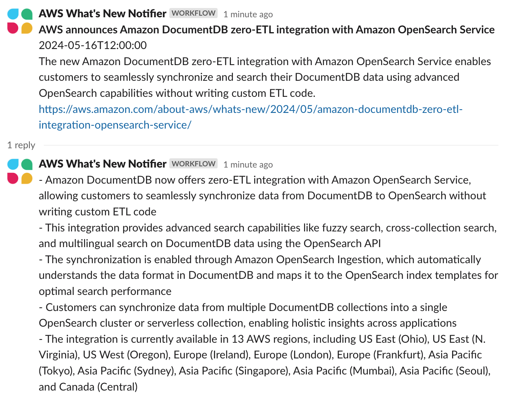

# Whats New Summary Notifier

**[日本語はこちら](README_ja.md)**

**Whats New Summary Notifier** is a sample implementation of a generative AI application that summarizes the content of AWS What's New and other web articles in multiple languages when there is an update, and delivers the summary to Slack or Microsoft Teams.

<p align="center">
  
</p>

## Architecture

This stack create following architecture.


## Prerequisites
- AWS Account with [CloudShell](https://console.aws.amazon.com/cloudshell/home) access
- Webhook URL for Slack or Microsoft Teams
- (For manual deploy only) Node.js 22+, Docker, [AWS CDK CLI](https://docs.aws.amazon.com/cdk/v2/guide/getting_started.html)

## Deployment Steps

### Create Webhook URL

#### For Slack
Refer to [this documentation](https://slack.com/help/articles/17542172840595-Build-a-workflow--Create-a-workflow-in-Slack) to create the Webhook URL. Select "Add a Variable" and create the following 5 variables, all with the Text data type:

* `rss_time`: The time the article was posted
* `rss_link`: The URL of the article
* `rss_title`: The title of the article
* `summary`: A summary of the article
* `detail`: A bulleted description of the article

#### For Microsoft Teams
Refer to [this documentation](https://learn.microsoft.com/en-us/microsoftteams/platform/webhooks-and-connectors/how-to/add-incoming-webhook?tabs=newteams%2Cdotnet) to create the Webhook URL.

### Deploy

Open [CloudShell](https://console.aws.amazon.com/cloudshell/home) and run:

```bash
git clone https://github.com/aws-samples/whats-new-summary-notifier.git
cd whats-new-summary-notifier
bash deploy.sh
```

The interactive wizard will guide you through selecting the notification destination (Slack/Teams), summary language, and entering your Webhook URL. Deployment runs via AWS CodeBuild automatically.

For advanced configuration options including multi-tenant deployment, please refer to the [Deployment Guide](DEPLOY.md).

## Management Console

A local web application for managing deployments, updating configurations, monitoring builds, and inspecting data. See the [Management Console Guide](CONSOLE.md) for details.

```bash
npm run dev:console
```

## Delete Stack

Using deploy.sh (recommended):
```bash
bash deploy.sh --destroy
```

Or manually:
```bash
cdk destroy
```
By default, some resources such as the Amazon DynamoDB table are set to not be deleted.
If you need to completely delete everything, you will need to access the remaining resources and manually delete them.

## Third Party Services
This code interacts with Slack or Microsoft Teams which has terms published at [Terms Page (Slack)](https://slack.com/main-services-agreement) / [Terms Page (Microsoft 365)](https://www.microsoft.com/en/servicesagreement), and pricing described at [Pricing Page (Slack)](https://slack.com/pricing) / [Pricing Page (Microsoft 365)](https://www.microsoft.com/en-us/microsoft-365/business/compare-all-microsoft-365-business-products?&activetab=tab:primaryr2). You should be familiar with the pricing and confirm that your use case complies with the terms before proceeding.
