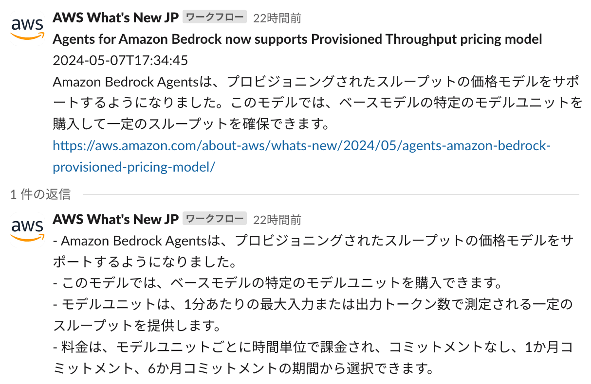
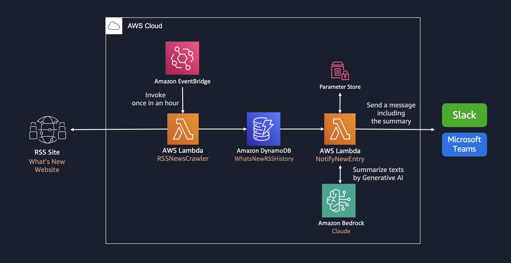

# Whats New Summary Notifier

**Whats New Summary Notifier** は、AWS 最新情報 (What's New) などのウェブ記事に更新があった際に記事内容を Amazon Bedrock で要約し、Slack への配信を行う生成 AI アプリケーションのサンプル実装です。

このアプリケーションは、WordPressで作成されたウェブサイトをサポートします。例えば、F1ニュースサイトに関連する設定を行いました。設定内容は、cdk.jsonで確認できます。

<p align="center">
  
</p>

## 機能

- **AI駆動の要約**: Strands Agent SDKとAmazon Bedrockモデルを使用したインテリジェントなコンテンツ要約
- **多言語サポート**: 日本語、英語、その他の言語での出力設定が可能
- **自動RSS監視**: 新しいコンテンツのスケジュール化されたRSSフィードクローリング
- **Slack統合**: SlackチャンネルへのサマリーのダイレクトDelivery
- **モダンな依存関係**: 自動解決による最新の互換バージョンの依存関係を使用

## アーキテクチャ



## 技術詳細

### 依存関係

このプロジェクトでは、以下の主要な依存関係を使用しています：

- **Strands Agent SDK**: AIモデルのインタラクションとエージェントベースの処理用
- **AWS CDK**: TypeScriptを使用したInfrastructure as Code
- **Python 3.12**: Lambda関数のランタイム
- **Docker**: AWS SAMを使用したLambda関数ビルドに必要

### Lambda関数

1. **RSS Crawler**: RSSフィードを監視し、新しいエントリをDynamoDBに保存
2. **Notify to App**: 新しいエントリを処理し、Strands Agent SDKを使用してAI要約を生成し、Slackに通知を送信

### 依存関係解決

このプロジェクトでは、複雑なパッケージ依存関係を処理するために自動依存関係解決を使用しています。`requirements.txt`ファイルは、依存関係リゾルバーが必要なすべてのパッケージの互換バージョンを自動的に見つけることができるように設定されています。

## 前提条件

- Unix コマンドを実行できる環境 (Mac、Linux、...)
  - そのような環境がない場合は、AWS Cloud9 を使用することも可能です。[操作環境の準備 (AWS Cloud9)](DEPLOY_ja.md) をご参照ください。
- aws-cdk
  - `npm install -g aws-cdk` でインストール可能です。詳しくは [AWS ドキュメント](https://docs.aws.amazon.com/cdk/v2/guide/getting_started.html)を参考にしてください。
- Docker
  - [`aws-lambda-python-alpha`](https://docs.aws.amazon.com/cdk/api/v2/docs/aws-lambda-python-alpha-readme.html) コンストラクトで Lambda をビルドするために Docker が必要です。詳しくは [Docker ドキュメント](https://docs.docker.com/engine/install/)を参考にしてください。

## デプロイ手順
>
> [!IMPORTANT]
> このリポジトリでは、デフォルトで米国東部 (バージニア北部) リージョン (us-east-1) の Anthropic Claude 3 Sonnet モデルを利用する設定になっています。[Model access 画面 (us-east-1)](https://us-east-1.console.aws.amazon.com/bedrock/home?region=us-east-1#/modelaccess)を開き、Anthropic Claude 3 Sonnet にチェックして Save changes してください。

### Webhook URL の取得

通知に必要となる Webhook URL の払い出しを行います。

#### Slack の設定

[こちらのドキュメント](https://slack.com/intl/ja-jp/help/articles/360041352714-%E3%83%AF%E3%83%BC%E3%82%AF%E3%83%95%E3%83%AD%E3%83%BC%E3%82%92%E4%BD%9C%E6%88%90%E3%81%99%E3%82%8B---Slack-%E5%A4%96%E9%83%A8%E3%81%A7%E9%96%8B%E5%A7%8B%E3%81%95%E3%82%8C%E3%82%8B%E3%83%AF%E3%83%BC%E3%82%AF%E3%83%95%E3%83%AD%E3%83%BC%E3%82%92%E4%BD%9C%E6%88%90%E3%81%99%E3%82%8B)を参考にして Webhook URL を取得してください。「変数を追加する」を選び、次の 5 つの変数をすべてテキストデータタイプで作成します。

- `rss_time`: 記事の投稿時間
- `rss_link`: 記事の URL
- `rss_title`: 記事のタイトル
- `summary`: 記事の要約
- `detail`: 記事の箇条書き説明

### AWS Systems Manager Parameter Store を作成

Parameter Store を使って 通知用の URL をセキュアに格納します。

#### パラメータストア登録 (AWS CLI)

```bash
aws ssm put-parameter \
  --name "/WhatsNew/URL" \
  --type "SecureString" \
  --value "<Webhook URL を入力>"
```

特定のAWSプロファイルを使用している場合は、`--profile`オプションを追加してください：

```bash
aws ssm put-parameter \
  --name "/WhatsNew/URL" \
  --type "SecureString" \
  --value "<Webhook URL を入力>" \
  --profile your-profile-name
```

### 言語設定の変更 (オプション)

このアセットはデフォルトで日本語の要約を出力するように設定されています。英語等の他言語の出力を行う場合は、`cdk.json` を開き、`context` 内の `notifiers` 内の `summarizerName` を `AwsSolutionsArchitectJapanese` から `AwsSolutionsArchitectEnglish` などに書き換えてください。その他の設定オプションについては[デプロイガイド](DEPLOY_ja.md)を参照してください。

### デプロイの実行

**初期化**

このリージョンで CDK を使用したことがない場合は、次のコマンドを実行します。

```bash
cdk bootstrap
```

特定のAWSプロファイルを使用している場合は、`--profile`オプションを追加してください：

```bash
cdk bootstrap --profile your-profile-name
```

**エラーがないことを確認**

```bash
cdk synth
```

特定のAWSプロファイルを使用している場合は、`--profile`オプションを追加してください：

```bash
cdk synth --profile your-profile-name
```

**デプロイの実行**

```bash
cdk deploy
```

特定のAWSプロファイルを使用している場合は、`--profile`オプションを追加してください：

```bash
cdk deploy --profile your-profile-name
```

## スタックの削除

不要になった場合は以下のコマンドを実行しスタックを削除します。

```bash
cdk destroy
```

特定のAWSプロファイルを使用している場合は、`--profile`オプションを追加してください：

```bash
cdk destroy --profile your-profile-name
```

デフォルトでは Amazon DynamoDB テーブルなど一部のリソースが削除されず残る設定となっています。
完全な削除が必要な場合は、残存したリソースにアクセスし、手動で削除を行ってください。

## トラブルシューティング

### 依存関係の競合

デプロイ中に依存関係の競合が発生した場合、システムが自動的に互換性のあるバージョンを解決します。requirements.txtファイルは、自動依存関係解決を可能にするように設定されています。

### Dockerビルドの問題

- CDKコマンドを実行する前にDockerが実行されていることを確認してください
- ビルドプロセスは自動的にダウンロードされるAWS SAMビルドイメージを使用します
- ビルドが失敗した場合は、まず`cdk synth`を実行して設定を確認してください

### よくある問題

1. **モデルアクセス**: AWSリージョンで必要なBedrockモデルが有効になっていることを確認してください
2. **プロファイル設定**: 名前付きAWSプロファイルを使用している場合は、常に`--profile`オプションを使用してください
3. **リージョンの一貫性**: すべてのリソースが同じAWSリージョンにデプロイされていることを確認してください

## 変更履歴

### 最近の更新

- **Strands Agent SDK統合**: 直接のBedrock API呼び出しからStrands Agent SDKに移行し、AIモデルのインタラクションを改善
- **依存関係管理**: パッケージ間の競合を防ぐための依存関係解決を改善
- **ドキュメント**: 包括的なトラブルシューティングガイドと技術詳細を追加
- **プロファイルサポート**: すべてのCDKおよびAWS CLIコマンドで`--profile`オプションサポートを強化

### 移行ノート

以前のバージョンからアップグレードする場合：
1. Lambda関数は直接のBedrock API呼び出しの代わりにStrands Agent SDKを使用するようになりました
2. 依存関係は自動的に解決されます - 手動でのバージョン管理は不要です
3. すべてのCDKコマンドでAWSプロファイル指定がサポートされるようになりました

## Third Party Services

このコードは 3rd Party Application である Slack と連携します。利用規約 [Terms Page (Slack)](https://slack.com/main-services-agreement) や価格設定 [Pricing Page (Slack)](https://slack.com/pricing) はこちらに公開されています。始める前に、価格設定を確認し、使用目的が利用規約に準拠していることを確認することを推奨します。
