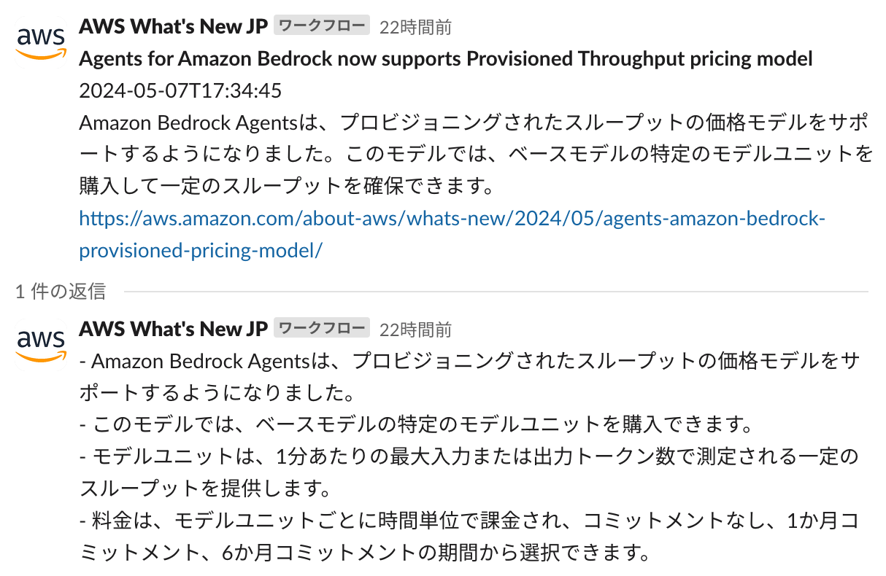
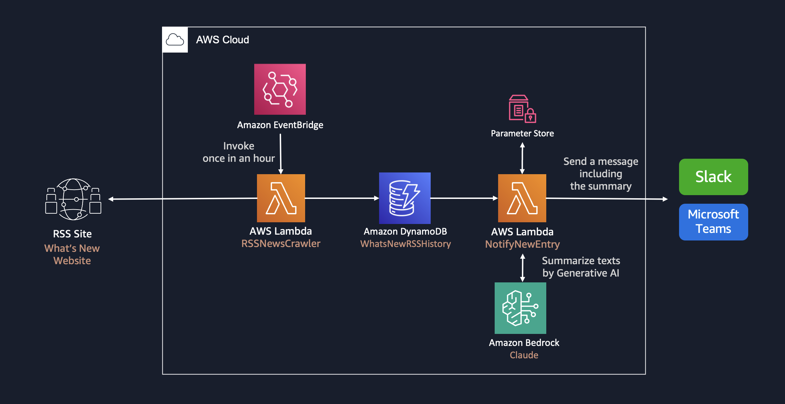

# Whats New Summary Notifier

**Whats New Summary Notifier** は、AWS 最新情報 (What's New) などのウェブ記事に更新があった際に記事内容を Amazon Bedrock で要約し、Slack や Microsoft Teams への配信を行う生成 AI アプリケーションのサンプル実装です。

<p align="center">
  
</p>

## アーキテクチャ



## 前提条件
- [CloudShell](https://console.aws.amazon.com/cloudshell/home) が利用可能な AWS アカウント
- Slack または Microsoft Teams の Webhook URL
- （手動デプロイの場合のみ）Node.js 22+, Docker, [AWS CDK CLI](https://docs.aws.amazon.com/cdk/v2/guide/getting_started.html)

## デプロイ手順

### Webhook URL の取得

#### Slack の場合
[こちらのドキュメント](https://slack.com/intl/ja-jp/help/articles/360041352714)を参考にして Webhook URL を取得してください。「変数を追加する」を選び、次の 5 つの変数をすべてテキストデータタイプで作成します:

* `rss_time`: 記事の投稿時間
* `rss_link`: 記事の URL
* `rss_title`: 記事のタイトル
* `summary`: 記事の要約
* `detail`: 記事の箇条書き説明

#### Microsoft Teams の場合
[こちらのドキュメント](https://learn.microsoft.com/ja-jp/microsoftteams/platform/webhooks-and-connectors/how-to/add-incoming-webhook?tabs=newteams%2Cdotnet)を参考にして Webhook URL を取得してください。

### デプロイ

[CloudShell](https://console.aws.amazon.com/cloudshell/home) を開き、以下を実行します:

```bash
git clone https://github.com/aws-samples/whats-new-summary-notifier.git
cd whats-new-summary-notifier
bash deploy.sh
```

対話ウィザードが通知先（Slack/Teams）、要約言語、Webhook URL を順に質問します。デプロイは AWS CodeBuild 経由で自動的に実行されます。

マルチテナントデプロイなどの詳細設定については[デプロイガイド](DEPLOY_ja.md)を参照してください。

## Management Console

デプロイの管理、設定の更新、ビルドの監視、データの確認を行うローカル Web アプリケーションです。詳細は [Management Console ガイド](CONSOLE_ja.md) を参照してください。

```bash
npm run dev:console
```

## スタックの削除

deploy.sh を使用（推奨）:
```bash
bash deploy.sh --destroy
```

または手動で:
```bash
cdk destroy
```
デフォルトでは Amazon DynamoDB テーブルなど一部のリソースが削除されず残る設定となっています。
完全な削除が必要な場合は、残存したリソースにアクセスし、手動で削除を行ってください。

## Third Party Services
このコードは 3rd Party Application である Slack または Microsoft Teams と連携します。利用規約 [Terms Page (Slack)](https://slack.com/main-services-agreement) / [Terms Page (Microsoft 365)](https://www.microsoft.com/en/servicesagreement) や価格設定 [Pricing Page (Slack)](https://slack.com/pricing) / [Pricing Page (Microsoft 365)](https://www.microsoft.com/en-us/microsoft-365/business/compare-all-microsoft-365-business-products?&activetab=tab:primaryr2) はこちらに公開されています。始める前に、価格設定を確認し、使用目的が利用規約に準拠していることを確認することを推奨します。
